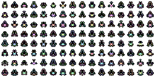
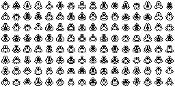

YX : Lib : Infiniship
=====================

_A remake of David Bollinger's "Pixel Spaceships", made in 2014._

> This is a procedural, pixelated, spaceship generator that tries to follow the same set of rules as [**David Bollinger's _Pixel Spaceships_**][0].

I first saw this script not in its [original form][0], but in a version made by **mtheall** for [HTML5 Canvas][1], in a blog post about a _["Homebrew Space Invaders Clone Compo"][2]_.

Seeing this and the original one, made in 2006 for [Processing][3], inspired me to try and rebuild the script in PHP as an exercise. Mostly because I wanted to know a little bit about how the script worked so I could build my own script.

Though, at first, I was only going to build the PHP version, as I started to study some languages to use on my work and game projects, I started building other versions and, also, rebuilding the HTML5 Canvas version.

I've also tried to put comments and descriptions inside the code to help anyone who wants to study, remix or simply use this code. But, even though I work with PHP since 2008, I feel like a total newbie in programming, so I'm sorry if some comments aren't that well explained or if I made mistakes. :P

Though the main reference for the script is the original one by David, I've used mtheall's version as reference for some of the structure and operations.

_**NOTE:** Some of the creative output (images) generated by this script remains property of David Bollinger, as this script follows his basic concept. Even though the possible combination of ships is huge, David still has copyright over his artistic output, so use this carefully. You are welcome (and highly encouraged) to fork, remix, create your own way to generate sprites and use this as reference to build your own generator. :)_

## Versions

This project has the original script, made for the following languages:

* **PHP**: first one built, it generates image resources and base64 encoded PNG files with a single ship or a sprite sheet (where you can determine how many ships you want). This one, also, is the one with more options in general (monochrome ships, smaller seed, background transparency);
* **HTML5 Canvas**: this one works almost the same way as the PHP version, though it doesn't have the option to use a smaller seed and the background is always transparent;
* **Haxe/OpenFl**: this is mostly experimental and built for fun, but worked nice here so I dediced to put it together with the other versions. It only generates a single colored ship;
* **ActionScript 3**: this is mostly adapted from the Haxe/OpenFl version, just took care with data types and some changes in loop format. Works the same as Haxe/OpenFl;
* **Processing**: mostly experimental, I tried to rebuild the Processing version using the Haxe version as reference. This one is the least commented version. Also, as it uses another seed generator, the results in this one may be a little different from the others;
* **GameMaker**: absolutely experimental version, this one has less comments than the other versions and uses surfaces to render the ships, I've included the GM project export for anyone interested. Also, there must be a way to make it more "elegant" (array declarations are HUGE! >_<);

I tried to follow, as far as I know, some OOP concepts in all of the projects. The rules for ship generation and color definition are basically the same, though.

The "smaller" seed option, found in the PHP version generates a smaller integer to be used as seed, resulting in smaller shapes and different colors. I made this by mistake, but found interesting and included as a "feature". :P

## Dependencies

Each project was made in a different programming language, with different dependencies. Please check on each project's folder for more information on these.

## Using

#### PHP Version

To use it, just include the main class file (`InfiniShip.php`) in your document, then create an instance of the `InfiniShip` class like this:

	// Including class file
	include 'InfiniShip.php';
	
	// Do you want to use the default (original) seed generator? (Optional, default: true)
	$seed = true;
	
	// Do you want to generate monochrome ships? (Optional, default: false)
	$mono = false;
	
	// Instance of the InfiniShip class
	$ship = new InfiniShip($seed, $mono);

After creating an instance, if you just want to print a single PNG (16px square) with a ship, like this:

Just do this:

	// Do you want a transparent background? (Optional, default: true)
	$tran = true;
	
	// Echoing a single ship on a base64 encoded PNG
	echo $ship->makeShip($tran);
	
If you want to generate a sprite sheet with multiple ships, this version works a little bit different from the original versions. In this version, you just declare the number of ships you want horizontally and vertically, so it can calculate the size of the final image. Just do it like this:
	
	// Number of ships horizontally and vertically (Both optional, default: 8, max: 64, can be changed)
	$shipX = 16;
	$shipY = 8;
	
	// Want a transparent background? (Optional, default: true)
	$tran = true;
	
	// Echoing the sprite sheet
	echo $ship->makeMultiple($shipX, $shipY, $tran);
	
The code above generates something like this (each ship takes 16px square):

Also, here's an example if you declare `true` in `$mono`:

And if you decide to use a smaller seed declaration (which is, in fact, PHP's `rand()` limited to 32768 max):

You can also return a single ship as an image resource, so you can convert it to other formats (JPG, GIF) or do other things. Just do it like this:
	
	// Transparent blah blah blah? (Optional, default: true)
	$tran = true;
	
	// Storing image resource
	$temp = $ship->generateSingle($tran);
	
_**Note:** for the PHP version to work, you **must** have GD on your PHP installation. Also, if you plan on generating really big sprite sheets, check your memory limits._

#### HTML5 Version

This version works almost the same way as the PHP version, but doesn't have the smaller seed declaration. Just include `InfiniShip.js` in your document and do this:

	<!-- INCLUDING JS FILE -->
	
	<!-- CREATING AN INSTANCE -->
	
	
Then, to render a single ship (16px square):
	
	// Creates a single ship
	ship.makeShip();
	
Or, to render a sprite sheet (each ship taking 16px square):
	
	// Number of ships you want horizontally and vertically (Optional, default: 8)
	shipX = 16;
	shipY = 8;
	
	// Generating sprite sheet
	ship.makeMultiple(shipX, shipY);
	
_**Note:** this version appends the images to the end of the `<body>` tag in the HTML file. You can change this inside the code._

#### Haxe/OpenFl Version + ActionScript3 Version

This is mostly experimental, but works just fine, and the Haxe version exports nicely in all OpenFl exporters (I think, just tested on Windows, Flash, Neko and HTML5 :P). This version only renders one coloured ship per instance, with a transparent background.

To use it, just include the package like this:
	
	// Importing stuff :)
	import br.com.yuiti.lab.InfiniShip;
	
Then just create an instance of the `InfiniShip` class, like this:

	// Instance of InfiniShip
	var Ship:InfiniShip = new InfiniShip();
	
	// Defining position
	Ship.x = 64;
	Ship.y = 64;
	
	// Adding it to stage
	addChild(Ship);

Then you just do whatever you want with it. :P

_**Note:** Differently from the PHP and HTML5 versions, the ships created in this version take 12px square._

#### Processing

All you have to do is create an instance of the InfiniShip class, and run the code like this:
	
	// Handle for the InfiniShip object
	InfiniShip ship;
	
	void setup()
	{
	    // Screen size, renderer
	    size(256, 256, P3D);
	    
	    // Background color
	    background(#ffffff);
	    
	    // Instance of InfiniShip
	    ship = new InfiniShip();
	    
	    // Printing a demo sprite sheet
	    ship.makeMultiple(16, 16);
	    
	    // Save frame as an image?
	    saveFrame("infiniship-####.png");
	}

#### GameMaker

This one is the most experimental one, so I don't have much to say about it. The description is only the way I'm using it inside the demo project, but I know there are better ways to do it. ;D

After you have the scripts in your project, inside the object that will serve as container for the ship sprite, in its _Create_ event, add the following lines of code:
	
	// Capturing the objects X and Y position, to make sure the sprite is 
	// placed in the correct position
	shipX = self.x;
	shipY = self.y;
	
	// Generates a sprite, rendered from a surface and stores it in "ship_sprite"
	ship_sprite = generateShip();
	
	// Set the sprite to the current object
	object_set_sprite(image_index, ship_sprite);

And, in its _Draw_ event, just put this line of code:
	
	// Draw the sprite in the desired position
	draw_sprite(ship_sprite, image_index, shipX, shipY);
	
And that's it. Place the object inside your room and execute the code. Inside the demo project I've included a placeholder sprite for the ship object, but I don't think it is necessary. :P

_**Note:** the ships generated by this script take 12px square...I think. :P_

## Authors

- **Fabio Y. Goto** ([lab@yuiti.com.br][mailto01])

## License

The code in this repo is released under the terms of the `MIT License`, please check the `LICENSE.md` file for more details.

Please bear in mind that, since the basis of the code follows the same rules as the original script, **some of the rendered output is protected by copyright**, which is held by the original author, David Bollinger.

## Thanks

A **HUGE** Thank You to my girlfriend, **Glauce**, for being a constant presence in my life and all the Love and motivation she gives me, in anything I do!

A **HUGE** Thank You to **David** who gave me permission to put this code here and share it. You're awesome, Dave!

Also, **HUGE** Thanks to **mtheall** for making the HTML5 Version, it was a huge help to use it side-by-side with the original script to study! :)

## Credits

* **Pixel Spaceships** (Original script in Processing), created by _David Bollinger_, July 2006;
* **Spaceship Generator** (HTML5 Canvas version), built by _mtheall_, August 2013;
* **InfiniShip**, built by _Fabio Y. Goto_, July 2014;

-----

_© 2015 Fabio Y. Goto_

[\\]: ======================================================================

[mailto01]: mailto:lab@yuiti.com.br
[0]: http://davebollinger.org/works/pixelspaceships
[1]: http://mtheall.com/~mtheall/spaceship.html
[2]: http://drunkencoders.com/2013/08/mtheall-has-responded-to-the-challenge-spaceship-generator-ported-to-an-html5-canvas/
[3]: http://processing.org
[4]: http://lab.yuiti.com.br
[5]: http://opensource.org/licenses/MIT

[\\]: ======================================================================
